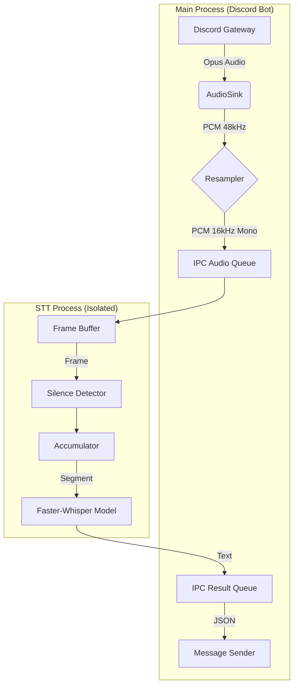

# 🎙️ Discord Real-time STT Bot (High Performance)


> **The Ultimate Low-Latency Speech-to-Text Solution for Discord.**
> Built for speed, accuracy, and stability using a multi-process architecture.

---

## ⚡ Why This Project?

This is not just another Discord bot. It is a **highly optimized engineering solution** designed to solve the common pitfalls of real-time audio processing: **Latency**, **Freezing**, and **Accuracy**.

Most bots fail because they run heavy AI models on the same thread as the Discord heartbeat, causing "Application did not respond" errors. We solved this with a **Process-Isolated Architecture**.

### 🚀 Key Engineering Highlights

-   **Multiprocessing Core**: The STT engine runs in a completely separate process, communicating via IPC Queues. The bot *never* freezes, even under heavy load.
-   **Zero-Latency Feel**:
    -   **Frame Buffering**: Captures short context so the first syllable is never cut off.
    -   **Faster-Whisper**: Uses CTranslate2-powered Whisper for 4x faster inference than standard OpenAI Whisper.
-   **Memory Safe**: Implements an **Auto-Cleanup Garbage Collector** that aggressively frees memory for inactive users.

---

## 🛠️ Architecture

This project uses a sophisticated pipeline to handle audio streams.



---

## 📦 Installation

### Prerequisites
-   **Python 3.10+**
-   **NVIDIA GPU** (Highly Recommended for <0.5s latency)
-   **FFmpeg** (Required for audio processing)

### 1. Clone & Install
```bash
git clone https://github.com/your-repo/discord-stt-bot.git
cd discord-stt-bot
pip install -r requirements.txt
```
> *Note: The first `faster-whisper` run downloads optimized kernels, so the initial setup may take a few minutes.*

### 2. Configuration
Create a `.env` file in the root directory:
```env
DISCORD_TOKEN=your_super_secret_token_here
```

### 3. Run
```bash
python main.py
```

---

## ⚙️ Configuration (`config.py`)

We believe in **Configuration as Code**. All magic numbers are exposed in `config.py` for fine-tuning.

| Category | Variable | Default | Description |
| :--- | :--- | :--- | :--- |
| **STT** | `STT_MODEL_ID` | `deepdml/faster-whisper...` | The HuggingFace model ID. |
| | `STT_DEVICE` | `cuda` | Use `cpu` if you don't have a GPU. |
| | `STT_BEAM_SIZE` | `1` | Lower is faster. Higher is more accurate. |
| **System** | `USER_TIMEOUT_SECONDS` | `60` | Seconds before clearing inactive user memory. |

---

## 🖥️ Usage

1.  **Summon**: Type `!join` in any text channel.
2.  **Speak**: Just talk. The bot listens to everyone simultaneously.
3.  **Dismiss**: Type `!leave` to save resources.

---

## 🧩 Troubleshooting

**Q: The bot joins but doesn't transcribe.**
> **A:** Check the console output and confirm that the STT process printed `Faster-Whisper loaded`. Also, ensure the user has permission to speak.

**Q: It's too slow!**
> **A:** Ensure `STT_DEVICE` is set to `cuda` in `config.py`. Running `large-v3` on CPU is not recommended. Switch to `base` or `small` for CPU usage.

**Q: "Input audio chunk is too short" error?**
> **A:** The STT worker enforces a **512-sample (32ms)** frame size. If you still see this error, verify that FFmpeg and Discord voice permissions are configured correctly so the bot receives continuous audio.

---

## 📜 License

This project is licensed under the MIT License. Feel free to fork, modify, and use it in your own projects.

---

<div align="center">
  <sub>Built with ❤️ by <b>Antigravity</b> for the Open Source Community.</sub>
</div>
